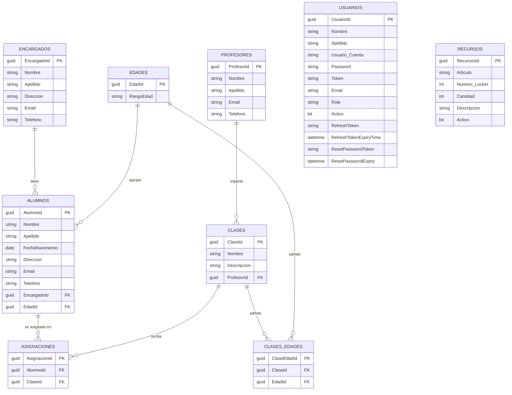

# Modelo de datos — DB_ENLACE

Fuente de verdad: las entidades de EF Core (`Models/`) y el `EnlaceContext` del backend, es decir,
el modelo real que expone la API. Este documento se deriva 1:1 del código del back.

## Diagrama de entidades

## Entidades (tablas)

### Alumnos
| Campo | Tipo | Notas |
|---|---|---|
| `AlumnoId` | Guid | PK, identity |
| `Nombre` | string? (150) | |
| `Apellido` | string? | |
| `FechaNacimiento` | date | |
| `Direccion` | string? (200) | |
| `Email` | string? | |
| `Telefono` | string? | |
| `EncargadoId` | Guid | FK → Encargados |
| `EdadId` | Guid | FK → Edades (requerido) |

### Encargados
| Campo | Tipo | Notas |
|---|---|---|
| `EncargadoId` | Guid | PK, identity |
| `Nombre` | string? (50) | |
| `Apellido` | string? (50) | |
| `Direccion` | string? (200) | |
| `Email` | string? | |
| `Telefono` | string? | |

### Profesores
| Campo | Tipo | Notas |
|---|---|---|
| `ProfesorId` | Guid | PK |
| `Nombre` | string | |
| `Apellido` | string | |
| `Email` | string | |
| `Telefono` | string | |

### Clases
| Campo | Tipo | Notas |
|---|---|---|
| `ClaseId` | Guid | PK |
| `Nombre` | string (50) | |
| `Descripcion` | string (200) | |
| `ProfesorId` | Guid | FK → Profesores |

### Edades
| Campo | Tipo | Notas |
|---|---|---|
| `EdadId` | Guid | PK, identity |
| `RangoEdad` | string | |

### ClasesEdades
| Campo | Tipo | Notas |
|---|---|---|
| `ClaseEdadId` | Guid | PK |
| `ClaseId` | Guid | FK → Clases |
| `EdadId` | Guid | FK → Edades |

### Asignaciones
| Campo | Tipo | Notas |
|---|---|---|
| `AsignacionId` | Guid | PK |
| `AlumnoId` | Guid | FK → Alumnos |
| `ClaseId` | Guid | FK → Clases |

### Usuarios
| Campo | Tipo | Notas |
|---|---|---|
| `UsuarioId` | Guid | PK |
| `Nombre` | string? | |
| `Apellido` | string? | |
| `Usuario_Cuenta` | string? | login |
| `Password` | string? | hash PBKDF2 |
| `Token` | string? | JWT en memoria de sesión |
| `Email` | string? | |
| `Role` | string? | ej. `User` |
| `Activo` | bit | default `true` |
| `RefreshToken` | string? (150) | |
| `RefreshTokenExpiryTime` | datetime | |
| `ResetPasswordToken` | string? | |
| `ResetPasswordExpiry` | datetime | |

### Recursos
| Campo | Tipo | Notas |
|---|---|---|
| `RecursosId` | Guid | PK |
| `Articulo` | string? (150) | |
| `Numero_Locker` | int | |
| `Cantidad` | int? | |
| `Descripcion` | string? (350) | |
| `Activo` | bit | default `false` |

## Cobertura de la API (controladores)

| Controlador | Entidad | Ruta |
|---|---|---|
| `EncargadosController` | Encargados | `/api/encargados` |
| `AlumnosController` | Alumnos | `/api/alumnos` |
| `ProfesoresController` | Profesores | `/api/profesores` |
| `RecursosController` | Recursos | `/api/recursos` |
| `EdadController` | Edades | `/api/edad` |
| `UsuariosController` | Usuarios | `/api/usuarios` |
| `AutenticarController` | Usuarios (auth) | `/api/autenticar` |
| `ResetEmailController` | Usuarios (reset) | `/api/ResetEmail` |

> `Clases`, `ClasesEdades` y `Asignaciones` existen como entidades y tablas de EF Core, pero **no
> tienen controlador** en la API actual. No forman parte del contrato expuesto al frontend.

## Notas de alineación con el frontend

- La serialización JSON es camelCase (convención por defecto de ASP.NET Core):
  `EncargadoId` → `encargadoId`, `Usuario_Cuenta` → `usuario_Cuenta`, `Numero_Locker` → `numero_Locker`.
- Los `Guid` viajan como `string` en JSON.
- El módulo `Material` del frontend **no tiene respaldo en el backend** (no existe entidad ni
  endpoint `/api/material`). Es un stub del frontend.
- Campos que el frontend ya no declara en sus interfaces por no existir en el back: `token` en
  encargados/alumnos/profesores/recursos.
